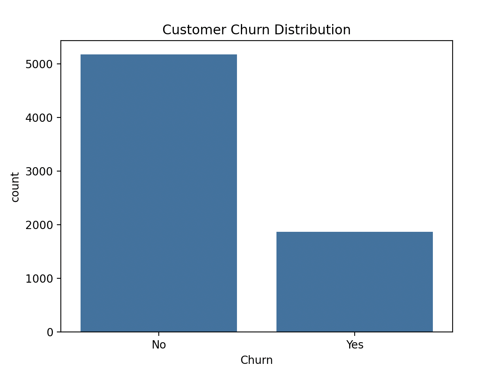
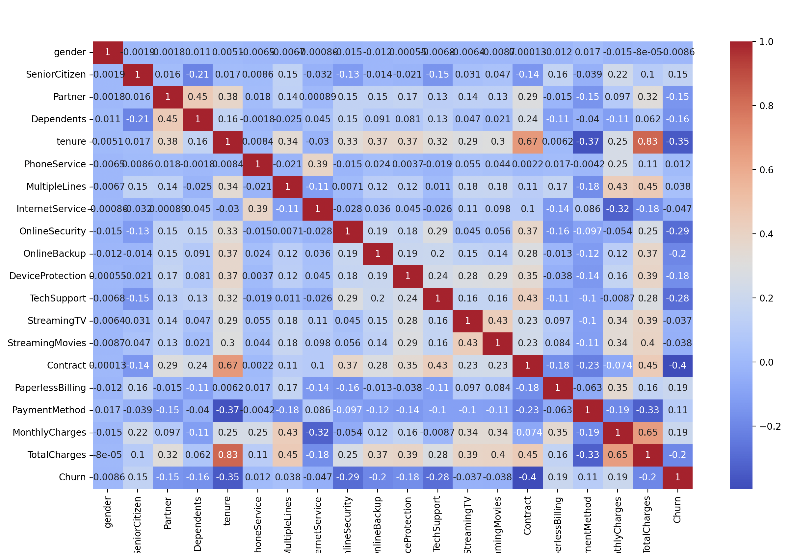
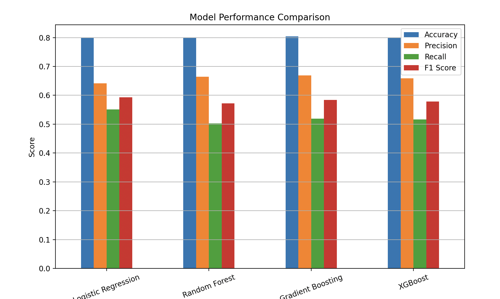
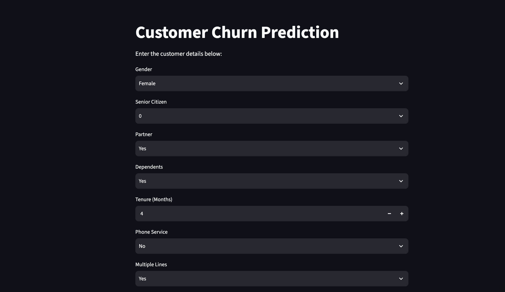
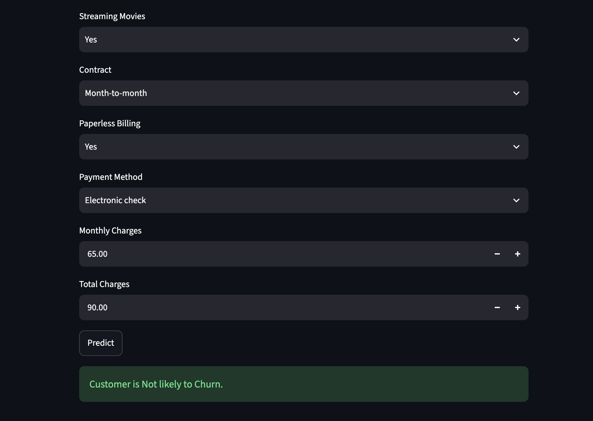

# Customer Churn Prediction using Machine Learning

## Overview

This project predicts whether a telecom customer is likely to churn based on customer demographics, account information, and subscribed services.

The project follows a complete machine learning workflow, including data cleaning, exploratory data analysis (EDA), feature engineering, model training, model evaluation, and deployment using Streamlit.

---

## Dataset

* Dataset: Telco Customer Churn Dataset
* Records: 7,043 customers
* Target Variable: **Churn**

  * Yes → Customer left
  * No → Customer stayed

---

## Technologies Used

* Python
* Pandas
* NumPy
* Matplotlib
* Seaborn
* Scikit-learn
* XGBoost
* Pickle
* Streamlit
* Git & GitHub

---

## Project Workflow

### 1. Data Cleaning

* Loaded the dataset
* Removed unnecessary columns
* Converted `TotalCharges` to numeric format
* Handled missing values
* Encoded categorical variables using LabelEncoder

### 2. Exploratory Data Analysis (EDA)

Performed detailed EDA using:

* Customer Churn Distribution
* Histograms
* Boxplots
* Countplots
* Churn vs Numerical Features
* Churn vs Categorical Features
* Correlation Heatmap

### 3. Machine Learning Models

The following models were trained and evaluated:

* Logistic Regression
* Random Forest
* Gradient Boosting
* XGBoost

### 4. Model Evaluation

Evaluation Metrics:

* Accuracy
* Precision
* Recall
* F1 Score
* Confusion Matrix
* Classification Report

### 5. Best Performing Model

Logistic Regression achieved the best overall performance.

| Metric    | Score  |
| --------- | ------ |
| Accuracy  | 79.91% |
| Precision | 64.17% |
| Recall    | 55.08% |
| F1 Score  | 59.28% |

The trained model was saved using Pickle and deployed with Streamlit.

---

## Project Screenshots

### Customer Churn Distribution



### Correlation Heatmap



### Model Comparison



### Streamlit Application



### Prediction Result



---

## How to Run the Project

### Clone the Repository

```bash
git clone 
```

### Install Dependencies

```bash
pip install -r requirements.txt
```

### Run the Streamlit Application

```bash
streamlit run churn_app.py
```

---

## Future Improvements

* Hyperparameter tuning
* Cross-validation
* Feature engineering
* Class imbalance handling using SMOTE
* Cloud deployment enhancements

---
